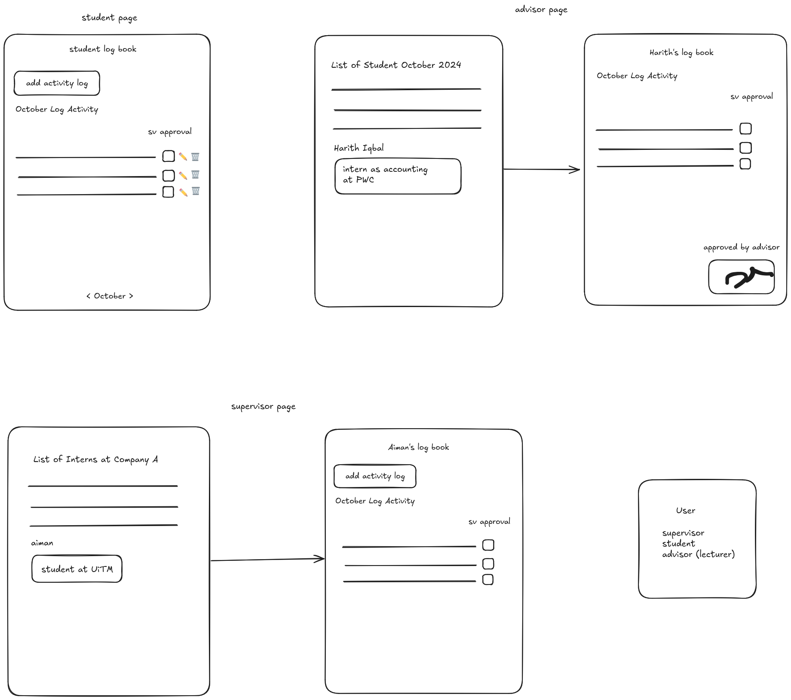
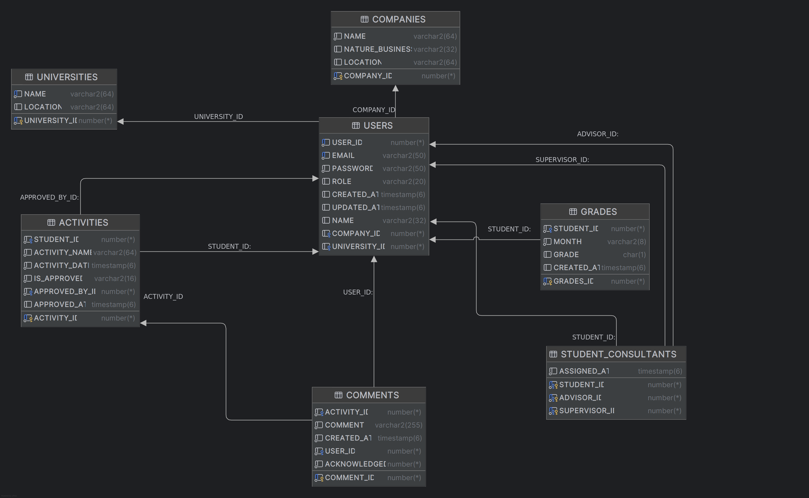

# InternTrack

#### This system is to solve the problem where supervisors and advisors cannot keep track of students' activities throughout their internship. By digitalizing the logbook activity, which is required during the internship duration, advisors from the university, supervisors from students' chosen companies, and students themselves no longer need to keep physical paper records.

### Software Dependencies

#### Integrated Development Environment (IDE)
- **Core Developer IDE**: IntelliJ IDEA  
- **Other Supported Editors**: Visual Studio Code (VS Code)  
- **Additionally Supported**: Apache NetBeans, Eclipse, or any other suitable IDE for Java Spring Boot projects.

#### Programming Language/Runtime Environment
- **Programming Language**: Java  
- **Runtime Environment**: Java Development Kit (JDK) 17  

#### Database Connectivity
- **Driver**: Oracle JDBC (`ojdbc8`)  
- **Framework**: Spring Data JPA (Java Persistence API) (via `spring-boot-starter-data-jpa`)  
- **ORM Tool**: Hibernate (`hibernate-core`, version 6.5.3.Final)  

#### Application Server
- The project runs on **Spring Boot's embedded application server**, specifically the **embedded Apache Tomcat** (default in Spring Boot).

### Database

1. Go to the directory `interntrack/src/main/resources/db` and open the file `schema.sql` and `migration.sql`.
2. Copy the content of it and run it in Oracle SQL (`schema` first, then `migration`).
3. Only run these SQL files if there are database changes or initial setup.

### Backend

###### To run the app locally, make a clean installation using Maven for the Java-side app. If you intend to use `.mvnw`, make sure the current working directory is in `interntrack` and contains `pom.xml`.

```bash
mvn clean install
# @
../mvnw clean install
```
Also can use command> .\mvnw clean install

```bash
mvn spring-boot:run
# @
../mvnw spring-boot:run
```
Also can use command> ./mvnw spring-boot:run

- Open http://localhost:8081 for viewing the website.

### Frontend

###### To build the frontend, go to the directory of `assets/static` and install using Node.js.

```bash
npm install
npm run build
```

###### To develop the frontend with hot reload:

```bash
npm install # if not installed yet or new packages added
npm run dev
```

- Open http://localhost:5173 to view the frontend app.

### UI Overview



### Database ERD




