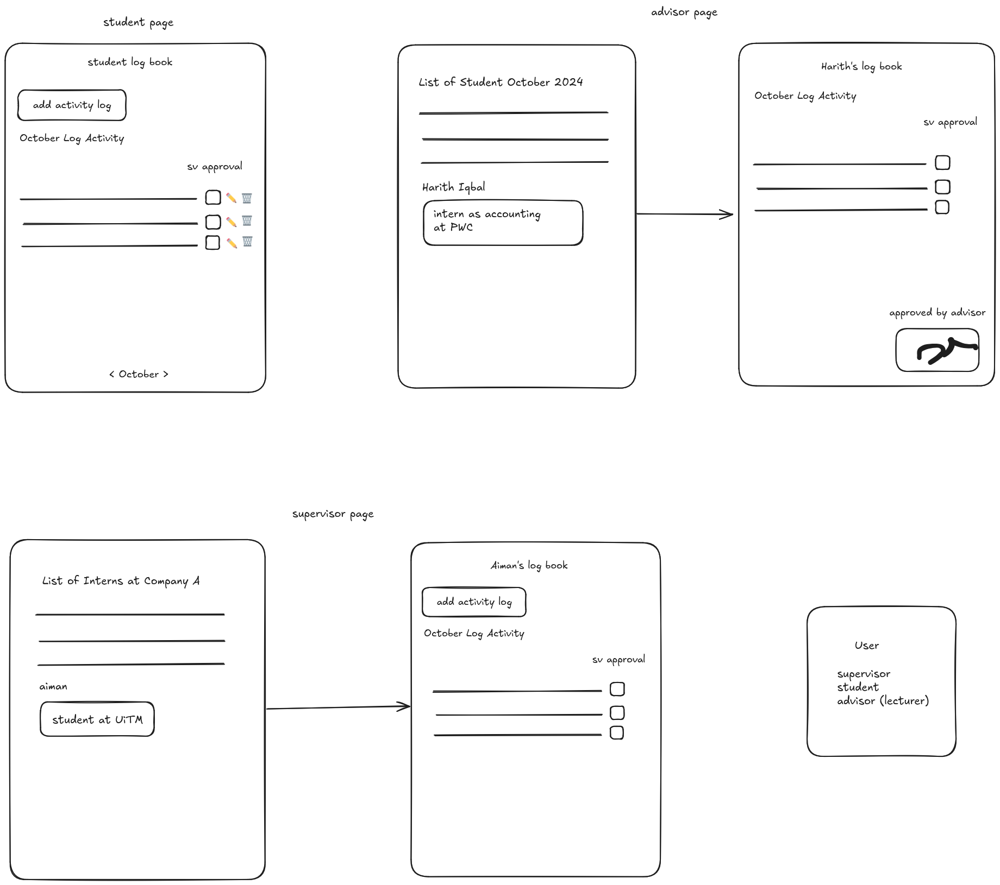

To create schema for Oracle database, run the following commands:

```sql
CREATE USER INTERNTRACK IDENTIFIED BY oracle;
GRANT CONNECT, RESOURCE TO INTERNTRACK;
GRANT CREATE SESSION, CREATE TABLE, CREATE SEQUENCE, CREATE VIEW, CREATE PROCEDURE, CREATE TRIGGER TO INTERNTRACK;
ALTER SESSION SET CURRENT_SCHEMA = INTERNTRACK;
```

To create a table for users, run the following commands:
```sql
CREATE SEQUENCE user_seq
START WITH 1
INCREMENT BY 1;

CREATE TABLE USERS (
  id          NUMBER PRIMARY KEY,
  name        VARCHAR2(255) NOT NULL,
  email       VARCHAR2(255) NOT NULL,
  password    VARCHAR2(255) NOT NULL
);

CREATE TRIGGER before_insert_users
BEFORE INSERT ON USERS
FOR EACH ROW
BEGIN
    IF :new.id IS NULL THEN
        SELECT user_seq.NEXTVAL INTO :new.id FROM dual;
    END IF;
END;
```

To check if the table was created successfully, run the following command:
```sql
SELECT * FROM USERS;
```

To run the app locally, clean install
Install
```bash
mvn clean install
# @ if run using ./mvnw, make sure to be in the same directory as the pom file

../mvnw clean install
```

```bash
mvn spring-boot:run

# @ if run using ./mvnw, make sure to be in the same directory as the pom file

../mvnw spring-boot:run
```

Open http://localhost:8081 for viewing the website

To build the front end, go to directory of assets static and install using node.js 20

```bash
npm install
npm run build
```

To develop front end with hot reload
```bash
npm install # if not installed yet or new packages added
npm run dev
```

Open http://localhost:5173 to view the frontend app

InternTrack Overview

